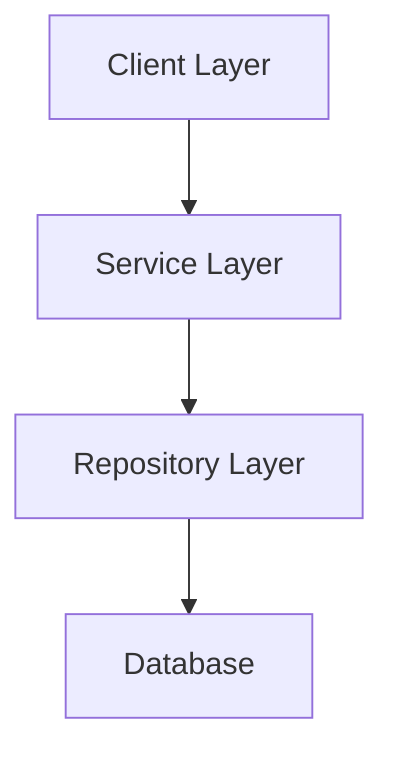
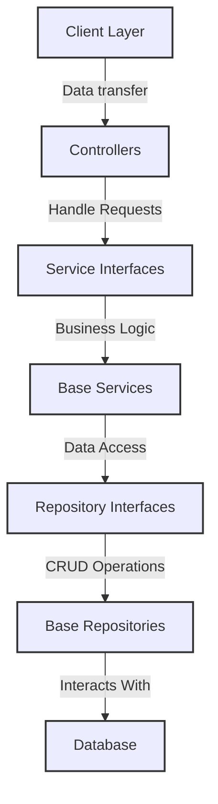

# Basic
:::note

Objective: Lay the foundational knowledge necessary for understanding more complex topics covered later in the tutorial.
:::

## Design Pattern {#design-pattern}
This project utilizes the Service Repository design pattern, whereby all business logic is centralized within the service layer and data retrieval is managed by the repository layer. The architecture includes base classes such as BaseService, BaseModel, BaseDTO, and BaseRepository, which facilitate code reuse and scalability with minimal effort. For querying, the project avoids raw SQL queries and instead employs JPA Criteria Builder, basic JPA Repository, and Specification, enhancing flexibility for operations like pagination.


for big picture what the structure code look like here i provide the diagram of code


Further information regarding the Base Service provided in this section is available for detailed review.

[Code Base](../../category/code-base).

## Project Structure {#project-structure}

```bash
arkopay-backend
│   .env
│   docker-compose.yml
│   Dockerfile
│   Dockerfile.staging
│   pom.xml
├───src
│   ├───main
│   │   ├───java
│   │   │   └───com
│   │   │       └───arkopay
│   │   │           └───backend
│   │   │               │   BackendApplication.java
│   │   │               │
│   │   │               ├───base
│   │   │               │   ├───annotations
│   │   │               │   │   └───auth
│   │   │               │   │           AuthAspect.java
│   │   │               │   │           ...
│   │   │               │   │
│   │   │               │   ├───dto
│   │   │               │   │   ├───data
│   │   │               │   │   │       BaseData.java
│   │   │               │   │   │       ...
│   │   │               │   │   │
│   │   │               │   │   ├───requests
│   │   │               │   │   │       BasePageRequest.java
│   │   │               │   │   │       ...
│   │   │               │   │   │
│   │   │               │   │   └───responses
│   │   │               │   │           BasicResponse.java
│   │   │               │   │           ...
│   │   │               │   │
│   │   │               │   ├───error
│   │   │               │   │       GenericError.java
│   │   │               │   │
│   │   │               │   ├───exception
│   │   │               │   │       ErrorException.java
│   │   │               │   │
│   │   │               │   ├───model
│   │   │               │   │       BaseModel.java
│   │   │               │   │
│   │   │               │   ├───repositories
│   │   │               │   │       BaseRepository.java
│   │   │               │   │       ...
│   │   │               │   │
│   │   │               │   ├───services
│   │   │               │   │   │   BaseService.java
│   │   │               │   │   │   ...
│   │   │               │   │   ...
│   │   │               │   │
│   │   │               │   └───utils
│   │   │               │           ErrorUtils.java
│   │   │               │
│   │   │               ├───config
│   │   │               │       AppConfig.java
│   │   │               │       ...
│   │   │               │
│   │   │               ├───controllers
│   │   │               │   ├───loan
│   │   │               │   │       LoanController.java
│   │   │               │   ...
│   │   │               │   
│   │   │               ├───dto
│   │   │               │   ├───data
│   │   │               │   │   ├───auth
│   │   │               │   │   │       AuthData.java
│   │   │               │   │   ...
│   │   │               │   │
│   │   │               │   ├───requests
│   │   │               │   │   ├───loan
│   │   │               │   │   │       LoanRequest.java
│   │   │               │   │   │       ...
│   │   │               │   │   ...
│   │   │               │   │
│   │   │               │   └───responses
│   │   │               ├───helper
│   │   │               │       FileUtils.java
│   │   │               │       ...
│   │   │               │
│   │   │               ├───models
│   │   │               │   │
│   │   │               │   ├───loan
│   │   │               │   │       Bank.java
│   │   │               │   │       GenderType.java
│   │   │               │   │       ...
│   │   │               │   │
│   │   │               │   ├───master
│   │   │               │   │   └───documents
│   │   │               │   │           DocumentType.java
│   │   │               │   ...
│   │   │               │
│   │   │               ├───repositories
│   │   │               │   ├───loan
│   │   │               │   │   │   ITrnLoanRepository.java
│   │   │               │   │   │   TrnLoanRepository.java
│   │   │               │   │   │
│   │   │               │   │   └───specifications
│   │   │               │   │           ILoanSpecifications.java
│   │   │               │   │           LoanSpecifications.java
│   │   │               │   ...
│   │   │               │
│   │   │               ├───seeder
│   │   │               │       DatabaseSeeder.java
│   │   │               │
│   │   │               └───services
│   │   │                   │
│   │   │                   ├───loan
│   │   │                   │       ILoanService.java
│   │   │                   │       LoanService.java
│   │   │                   ...
│   │   │
│   │   └───resources
│   │       │   application-localdocker.properties
│   │       │   application-sample.properties
│   │       │   application-staging.properties
│   │       │   application.properties
│   │       │
│   │       ├───static
│   │       └───templates
│   └───test
│       └───java
│           └───com
│               └───arkopay
│                   └───backend
│                           BackendApplicationTests.java
│

```


